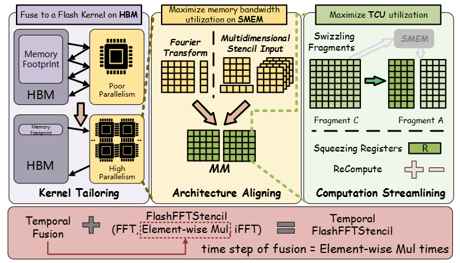

# FlashFFTStencil: Bridging Fast Fourier Transforms to Memory-Efficient Stencil Computations on Tensor Core Units

This repository contains the official code for FlashFFTStencil, a memory-efficient stencil computing system designed to bridge fast Fourier transforms to fully-dense stencil computations on Tensor Core Units.

FlashFFTStencil demonstrates remarkable efficiency in stencil computations, achieving an average speedup of 2.57× over the current state-of-the-art methods. Notably, in 1D cases, it achieves an exceptional 103.0× speedup compared to stencil implementations based on cuFFT.


**FlashFFTStencil: Bridging Fast Fourier Transforms to Memory-Efficient Stencil Computations on Tensor Core Units (PPoPP'25)** \
Paper: https://ppopp25.sigplan.org/track/PPoPP-2025-Main-Conference-1 \
Blog: https://mp.weixin.qq.com/s/KBUiKvvXqAHB0YC5XdQ4ww




## Contact

If you have any questions or would like to discuss more detail, please feel free to reach out to Haozhi at **haozhi.han@stu.pku.edu.cn**.


## Run

Requires CUDA 12.1 and an NVIDIA A100 (SM80). Run the following commands from the repository root.

### 1D

```sh
nvcc -O3 --use_fast_math -arch=sm_80 src/1D/1d_main.cu -lcufft -o 1d.out
./1d.out Heat-1D 917504 14
./1d.out 1D5P 917504 7
./1d.out 1D7P 851968 5
```

Arguments: `./1d.out <stencil> <input_size> <time_step>`.

| Stencil | Input size must be a multiple of | Positive time_step must be a multiple of |
|---|---:|---:|
| Heat-1D | 56 | 14 |
| 1D5P | 56 | 7 |
| 1D7P | 52 | 5 |

The program prints elapsed time and throughput. `time_step` controls repetitions of the fixed filter on the same input.

### 2D / 3D example

Save the following as `run_stencil.cu` in the repository root. It runs one periodic FP64 Box or Star convolution with uniform normalized coefficients.

```cpp
#include <cuda_runtime.h>
#include <cstdio>
#include <cstdlib>
#include <vector>
#include <string>
#if DIM == 2
#include "src/2D/common/fft_overlap_save/fft_2d.cuh"
using Plan = FlashFFT2DPlan;
#define CREATE flashfft2dCreatePlan
#define EXECUTE flashfft2dExecute
#define DESTROY flashfft2dDestroyPlan
#else
#include "src/3D/common/fft_overlap_save/fft_3d.cuh"
using Plan = FlashFFT3DPlan;
#define CREATE flashfft3dCreatePlan
#define EXECUTE flashfft3dExecute
#define DESTROY flashfft3dDestroyPlan
#endif
void check(cudaError_t error) {
    if (error != cudaSuccess) {
        std::fprintf(stderr, "%s\n", cudaGetErrorString(error));
        std::exit(1);
    }
}
int main(int argc, char** argv) {
    if (argc != 4) return 1; // width radius box|star
    int width = std::atoi(argv[1]), radius = std::atoi(argv[2]);
    std::string shape = argv[3];
    if (width < 64 || radius < 1 || radius > 3 ||
        (shape != "box" && shape != "star")) return 1;
    int side = 2 * radius + 1, count = 0;
    size_t points = 1, taps = 1;
    for (int axis = 0; axis < DIM; ++axis) { points *= width; taps *= side; }
    std::vector<double> coeff(taps, 0), input(points, 1.0);
    for (size_t i = 0; i < taps; ++i) {
        size_t index = i;
        int nonzero = 0;
        for (int axis = 0; axis < DIM; ++axis) {
            nonzero += (int(index % side) != radius); index /= side;
        }
        if (shape == "box" || nonzero <= 1) { coeff[i] = 1; ++count; }
    }
    for (double& value : coeff) value /= count;
    Plan* plan = nullptr;
    double *device_input = nullptr, *device_output = nullptr, result;
    check(CREATE(&plan, coeff.data(), radius));
    check(cudaMalloc(&device_input, points * sizeof(double)));
    check(cudaMalloc(&device_output, points * sizeof(double)));
    check(cudaMemcpy(device_input, input.data(), points * sizeof(double), cudaMemcpyHostToDevice));
    check(EXECUTE(plan, device_input, device_output, width));
    check(cudaDeviceSynchronize());
    check(cudaMemcpy(&result, device_output, sizeof(double), cudaMemcpyDeviceToHost));
    std::printf("output[0] = %.15g (expected 1)\n", result);
    check(DESTROY(plan));
    check(cudaFree(device_input)); check(cudaFree(device_output));
}
```

### 2D

```sh
nvcc -std=c++17 -O3 --use_fast_math -arch=sm_80 -rdc=true -DDIM=2 \
  run_stencil.cu src/2D/Box9P/fft_overlap_save/fft_2d.cu -o 2d.out
./2d.out 1024 1 box
./2d.out 1024 1 star
```

Arguments: `./2d.out <width> <radius> <box|star>`; the grid is `width × width`.

| Radius | Box | Star |
|---:|---|---|
| 1 | Box9P | Star5P |
| 2 | Box25P | Star9P |
| 3 | Box49P | Star13P |

Each type has a `src/2D/<type>/fft_overlap_save/fft_2d.cu` entry. Link one entry; coefficients select the operator. See the [2D API](src/2D/common/fft_overlap_save/README.md) for custom coefficients and Pack / Compute / Unpack.

### 3D

```sh
nvcc -std=c++17 -O3 --use_fast_math -arch=sm_80 -rdc=true -DDIM=3 \
  run_stencil.cu src/3D/Box27P/full_fft/fft_3d.cu -o 3d.out
./3d.out 128 1 box
./3d.out 128 1 star
```

Arguments: `./3d.out <width> <radius> <box|star>`; the grid is `width × width × width`. Radius 1 selects Box27P or Star7P.

Entries: `src/3D/Box27P/full_fft/fft_3d.cu` and `src/3D/Star7P/full_fft/fft_3d.cu`. Link one entry; coefficients select the operator. Effective radii 1–3 are supported. See the [3D API](src/3D/common/fft_overlap_save/README.md) for custom coefficients and Pack / Compute / Unpack.

## Reference

Haozhi Han, Kun Li, Wei Cui, Donglin Bai, Yiwei Zhang, Liang Yuan, Yifeng Chen, Yunquan Zhang, Ting Cao, and Mao Yang. 2025. FlashFFTStencil: Bridging Fast Fourier Transforms to Memory-Efficient Stencil Computations on Tensor Core Units. In The 30th ACM SIGPLAN Annual Symposium on Principles and Practice of Parallel Programming (PPoPP ’25), March 1–5, 2025, Las Vegas, NV, USA. ACM, New York, NY, USA, 14 pages. https://doi.org/10.1145/3710848.3710897
